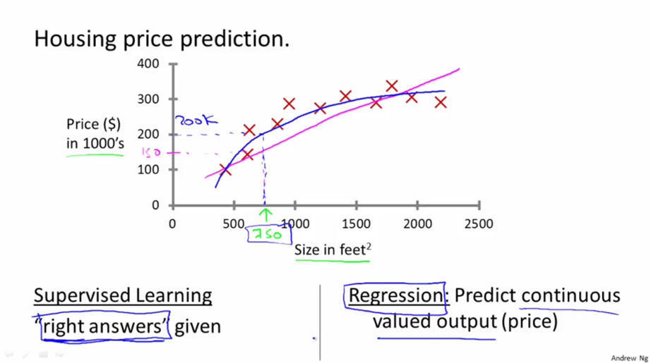

# 监督学习 vs 无监督学习

- 监督学习(Supervised Learning)

在监督学习中，给定一组数据，我们知道正确的输出结果应该是什么样子，并且知道在输入和输出之间有着一个特定的关系。这么说可能理解起来不是很清晰，没关系，后面有具体的例子。

- 监督学习的分类

监督学习可分为“回归”和“分类”问题。

在回归问题中，我们会预测一个连续值。也就是说我们试图将输入变量和输出用一个连续函数对应起来；而在分类问题中，我们会预测一个离散值，我们试图将输入变量与离散的类别对应起来。

下面举两个例子，就会非常清楚这几个概念了。

- 监督学习举例
- 回归

通过房地产市场的数据，预测一个给定面积的房屋的价格就是一个回归问题。这里我们可以把价格看成是面积的函数，它是一个连续的输出值。 但是，当把上面的问题改为“预测一个给定面积的房屋的价格是否比一个特定的价格高或者低”的时候，这就变成了一个分类问题, 因为此时的输出是‘高’或者‘低’两个离散的值。

- 分类

给定医学数据，通过肿瘤的大小来预测该肿瘤是恶性瘤还是良性瘤(课程中给的是乳腺癌的例子)，这就是一个分类问题，它的输出是0或者1两个离散的值。(0代表良性，1代表恶性)。

分类问题的输出可以多于两个，比如在该例子中可以有{0,1,2,3}四种输出，分别对应{良性, 第一类肿瘤, 第二类肿瘤, 第三类肿瘤}。

下图中上下两个图只是两种画法。第一个是有两个轴，Y轴表示是否是恶性瘤，X轴表示瘤的大小; 第二个是只用一个轴，但是用了不同的标记，用O表示良性瘤，X表示恶性瘤。

在这个例子中特征只有一个，那就是瘤的大小。 有时候也有两个或者多个特征, 例如下图， 有“年龄”和“肿瘤大小”两个特征。(还可以有其他许多特征，如下图右侧所示)

